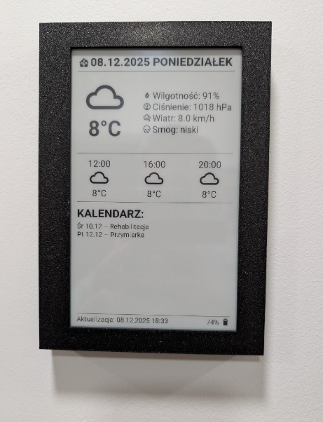
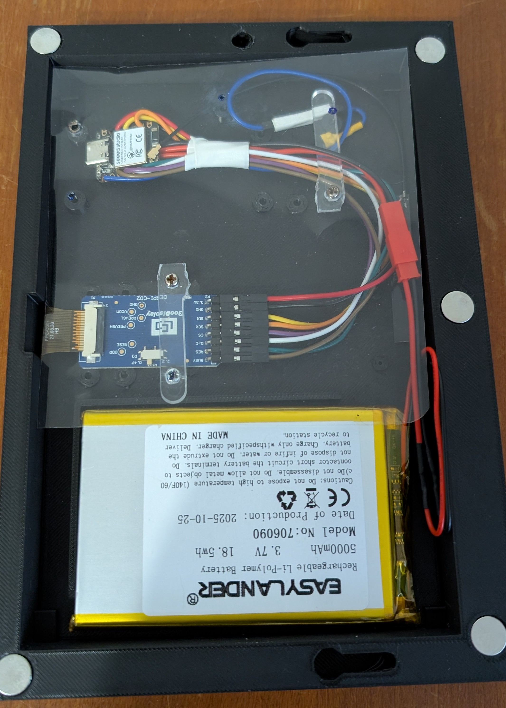

# 🖼️ ESPHome E-Ink HA Dashboard Battery Deepsleep

> Minimalistyczna, energooszczędna ramka E-Ink wyświetlająca kluczowe dane z Home Assistant (pogoda, kalendarz) zoptymalizowana pod kątem długiej pracy na baterii.

## 🇵🇱 Opis Projektu

Celem projektu było stworzenie **ramki informacyjnej opartej na technologii E-Ink (papier elektroniczny)**. Ramka ma za zadanie wyświetlać kluczowe dane z systemu **Home Assistant (HA)**, takie jak data, prognoza pogody oraz najbliższe wydarzenia z kalendarzy, jednocześnie utrzymując **maksymalną żywotność baterii**.

### 🔋 Kluczowe Wyzwanie: Zarządzanie Energią

Podczas testowania różnych płytek ESP32 stwierdzono, że większość z nich (np. ESP32-S3 z PSRAM) cechowała się znacznym poborem prądu w trybie *deepsleep* (ok. 5mA), co było nieakceptowalne dla długotrwałej pracy na baterii.

**Rozwiązanie:** Ostatecznie wybrano moduł **Seeed Studio XIAO ESP32C6** ze względu na:
1.  Bardzo niski pobór prądu w *deepsleep*.
2.  Wbudowaną obsługę i kontrolę ładowania baterii.

### ⏱️ Strategia Odświeżania

W celu optymalizacji zużycia energii zastosowano następującą strategię:
* **W ciągu dnia:** Odświeżanie danych raz na godzinę.
* **Noc:** Po godzinie 22:00 urządzenie wchodzi w tryb *deepsleep* na 8 godzin.

---

## 🛠️ Wykorzystane Komponenty

| Komponent | Model/Opis | Link |
| :--- | :--- | :--- |
| **Główny Moduł** | XIAO ESP32C6 | [Seeed Studio Wiki](https://wiki.seeedstudio.com/xiao_esp32c6_getting_started) |
| **Ekran E-Ink** | GDEY075T7 7.5 cala, szybki, czarno-biały | [Good Display - GDEY075T7](https://www.good-display.com/product/396.html) |
| **Adapter/HAT** | DESPI-C02 (Adapter do modułów ePaper) | [Good Display - DESPI-C02](https://www.good-display.com/product/516.html) |
| **Zasilanie** | Bateria Lithium Li-ion Polymer 706090, 3.7V, 5000mAh | N/A |
| **Obudowa** | Ramka wydrukowana 3D | [Printables - Frame](https://www.printables.com/model/661183-e-ink-weather-station-frame/files) |

### ⚡ Pomiar Napięcia Baterii

Do monitorowania poziomu naładowania baterii zastosowano **dzielnik napięcia 1:1** (dwa rezystory 200kΩ). Wyjście z dzielnika jest podłączone do pinu **ADC** na ESP32C6.

> ⚠️ **Uwaga:** Dla dalszej redukcji zużycia prądu, idealnym rozwiązaniem jest zastosowanie dzielnika odłączanego za pomocą tranzystora.

---

## 🏡 Integracja z Home Assistant (ESPHome)

Projekt wykorzystuje **ESPHome** do komunikacji z HA. Dane są wstępnie przygotowywane w Home Assistant za pomocą *Text Helpers* i automatyzacji, a następnie pobierane przez urządzenie E-Ink.

### Wymagane Encje w Home Assistant

| Typ Encji | Przykład | Cel |
| :--- | :--- | :--- |
| **Text Helper (Pogoda)** | `input_text.eink_forecast_12_wu` | 3 helpery przechowujące prognozę pogody na ustalone godziny (12:00, 16:00, 20:00). |
| **Text Helper (Kalendarz)** | `input_text.kalendarz_e_ink_linia1` | 8 helperów (linii) przechowujących najbliższe wydarzenia z kalendarzy HA. |
| **Sensor (Jakość Powietrza)** | `sensor.airly_poziom_smogu_pl` | 1 encja pomocnicza z danymi o jakości powietrza (np. z Airly). |
| **Boolean Helper (Sterowanie)** | `input_boolean.zapobiega_deepsleep_esp_ramka` | Włącznik/wyłącznik do tymczasowego zablokowania wejścia ESP w *deepsleep*. |

---

## 📸 Galeria

| Ramka przód | Ramka tył |
| :---: | :---:
|  | 

---

## 🇬🇧 English Translation

This section contains the English version of the project description for international users.

### Project Description

The goal was to create an **E-Ink (electronic paper) information frame** to display key data from a **Home Assistant (HA)** system, such as the date, weather forecast, and upcoming calendar events, while ensuring **maximum battery life**.

**Key Power Challenge:** The project uses the **Seeed Studio XIAO ESP32C6** due to its exceptionally **low current draw in deepsleep**, solving the issue encountered with other ESP32 boards (approx. 5mA consumption).

**Refresh Strategy:** The device refreshes once every hour during the day and enters an 8-hour deepsleep mode after 10:00 PM (22:00) to optimize battery performance.
